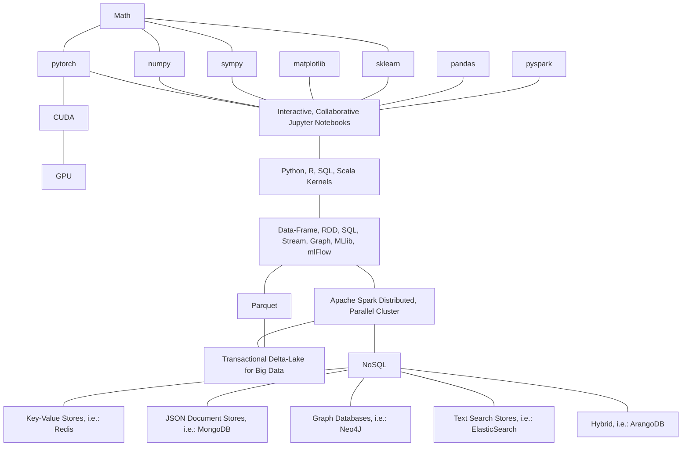

# Apache Spark, Data-Lake, NoSQL, GPU

```mermaid
graph TB
    Math---pytorch
    Math---numpy
    Math---sympy
    Math---sklearn
    pyspark---notebooks
    pandas---notebooks
    sklearn---notebooks
    matplotlib---notebooks
    sympy---notebooks
    numpy---notebooks
    pytorch---notebooks
    pytorch---CUDA
    CUDA---GPU
    notebooks[Interactive, Collaborative Jupyter Notebooks]---kernels
    kernels[Python, R, SQL, Scala Kernels]---apis
    apis[Data-Frame, RDD, SQL, Stream, Graph, MLlib, mlFlow] --- sp
    apis---Parquet
    Parquet---dl
    sp[Apache Spark Distributed, Parallel Cluster]---dl[Transactional Delta-Lake for Big Data]
    sp---NoSQL
    NoSQL---kv[Key-Value Stores, i.e.: Redis]
    NoSQL---js[JSON Document Stores, i.e.: MongoDB]
    NoSQL---gp[Graph Databases, i.e.: Neo4J]
    NoSQL---ts[Text Search Stores, i.e.: ElasticSearch]
    NoSQL---hb[Hybrid, i.e.: ArangoDB]
```