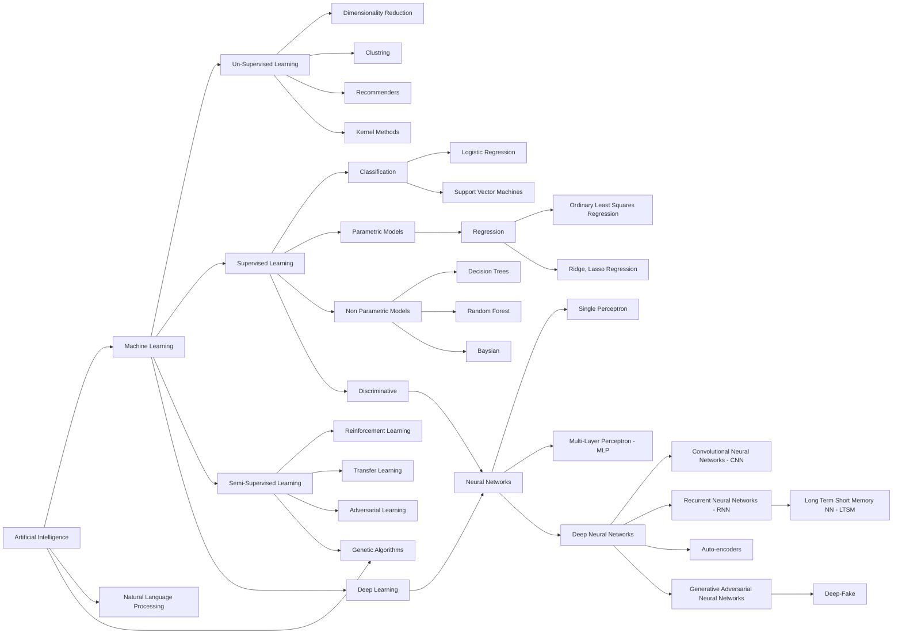

# Artificial Inelligence Taxonomy  

```mermaid
graph LR
    ai[Artificial Intelligence]-->ml[Machine Learning]
    ai-->nlp[Natural Language Processing]
    ml-->ul[Un-Supervised Learning]
    ml-->sl[Supervised Learning]
    ml-->sml[Semi-Supervised Learning]
    ai-->ga[Genetic Algorithms]
    ul-->dr[Dimensionality Reduction]
    ul-->Clustring
    ul-->re[Recommenders]
    ul-->k[Kernel Methods]
    sl-->clf[Classification]
    clf-->lreg[Logistic Regression]
    clf-->svm[Support Vector Machines]
    sl-->pm[Parametric Models]
    pm-->Regression
    Regression-->ols[Ordinary Least Squares Regression]
    Regression-->ridge[Ridge, Lasso Regression]
    sl-->npm[Non Parametric Models]
    npm-->decTr[Decision Trees]
    npm-->rf[Random Forest]
    npm-->Baysian
    sl-->Discriminative
    Discriminative--> nn[Neural Networks]
    ml-->dl[Deep Learning]
    dl-->nn
    nn-->sp[Single Perceptron]
    nn-->mlp[Multi-Layer Perceptron - MLP]
    nn-->dnn[Deep Neural Networks]
    dnn-->CNN[Convolutional Neural Networks - CNN]
    dnn-->RNN[Recurrent Neural Networks - RNN]
    RNN-->LTSM[Long Term Short Memory NN - LTSM]
    dnn-->ae[Auto-encoders]
    dnn-->gan[Generative Adversarial Neural Networks]
    gan-->df[Deep-Fake]
    sml-->rl[Reinforcement Learning]
    sml-->tl[Transfer Learning]
    sml-->al[Adversarial Learning]
    sml-->ga
```
