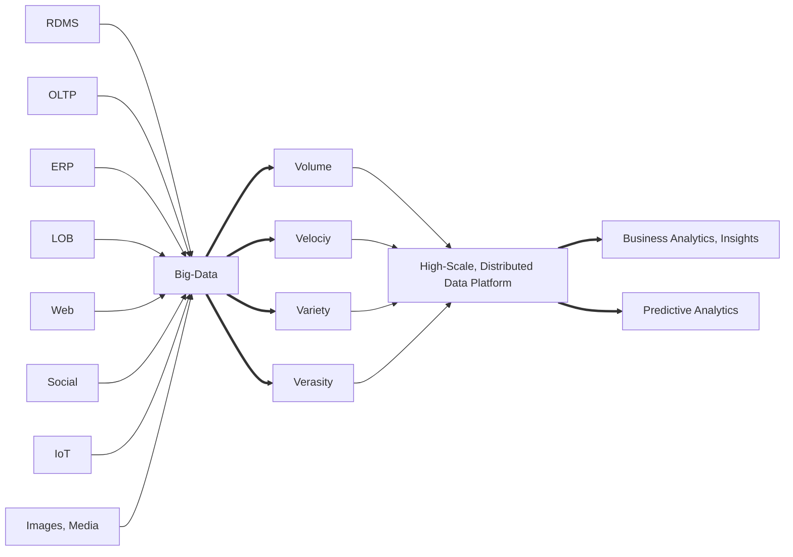
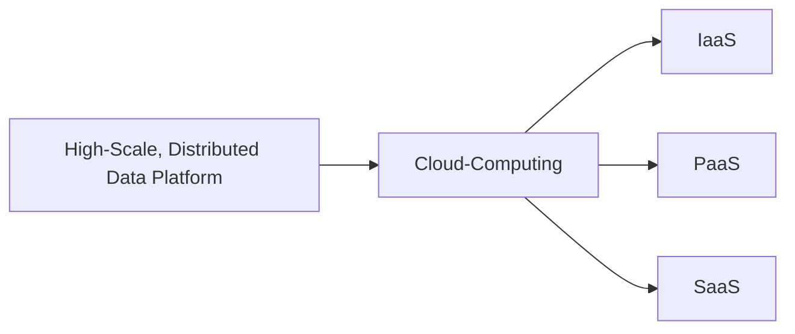
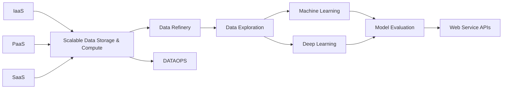

# Big-Data

```mermaid
graph LR
    RDMS-->bd[Big-Data]
    OLTP-->bd
    ERP-->bd
    LOB-->bd
    Web-->bd
    Social-->bd
    IoT-->bd
    i[Images, Media]-->bd
    bd==>Volume
    bd==>Velociy
    bd==>Variety
    bd==>Verasity
    Volume-->P[High-Scale, Distributed Data Platform]
    Velociy-->P
    Variety-->P
    Verasity-->P
    P==>bi[Business Analytics, Insights]
    P==>pa[Predictive Analytics]
```

# Cloud Computing

```mermaid
graph LR
    P[High-Scale, Distributed Data Platform]-->cc[Cloud-Computing]
    cc-->IaaS
    cc-->PaaS
    cc-->SaaS
```

# Data Platform

```mermaid
graph LR
    IaaS-->sc[Scalable Data Storage & Compute]
    PaaS-->sc
    SaaS-->sc
    sc-->dr[Data Refinery]
    dr-->de[Data Exploration]
    de-->ml[Machine Learning]
    de-->dl[Deep Learning]
    ml-->me[Model Evaluation]
    dl-->me
    me-->web[Web Service APIs]
    sc-->DATAOPS

    
```