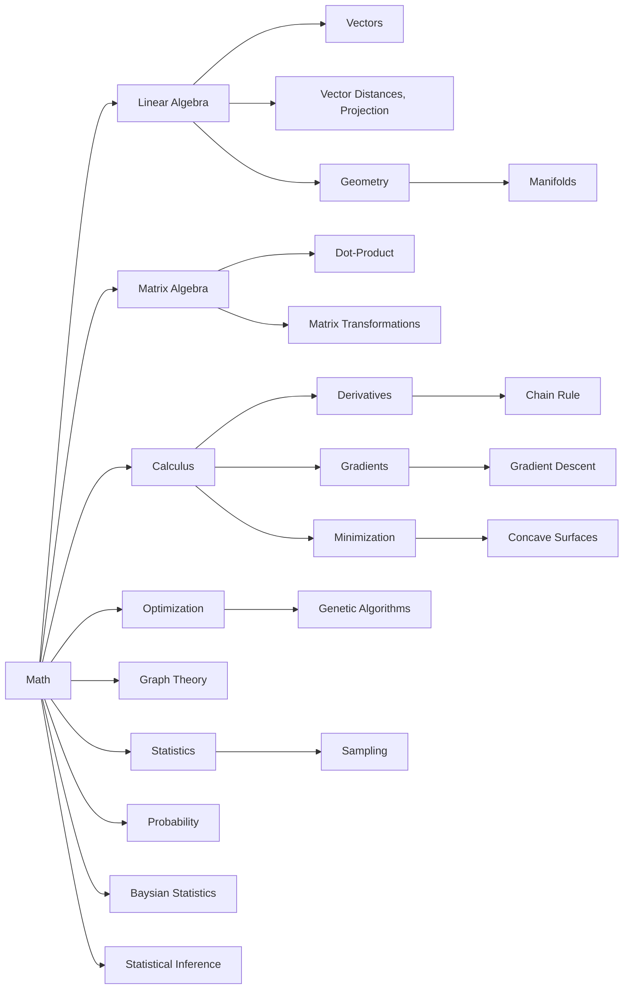

# Math

```mermaid
graph LR
    m[Math]-->la[Linear Algebra]
    la-->Vectors
    la-->d[Vector Distances, Projection]
    la-->Geometry
    Geometry--> Manifolds
    m-->ma[Matrix Algebra]
    ma-->dpp[Dot-Product]
    ma-->mt[Matrix Transformations]
    m-->c[Calculus]
    c-->Derivatives
    Derivatives-->cr[Chain Rule]
    c-->Gradients
    Gradients-->gd[Gradient Descent]
    c-->Minimization
    Minimization-->cs[Concave Surfaces]
    m-->Optimization
    Optimization--> ga[Genetic Algorithms]
    m--> g[Graph Theory]
    m--> Statistics
    Statistics--> Sampling
    m-->Probability
    m--> bs[Baysian Statistics]
    m-->si[Statistical Inference]
```