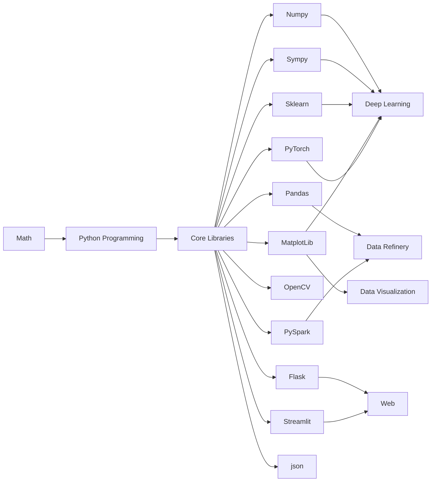

# Pyton Programming

```mermaid
graph LR
    m[Math]-->Py[Python Programming]
    Py-->cl[Core Libraries]
    cl-->Numpy
    cl-->Sympy
    cl-->Pandas
    cl-->PySpark
    cl-->Sklearn
    cl-->MatplotLib
    cl-->OpenCV
    cl-->PyTorch
    cl-->Flask
    cl-->Streamlit
    cl-->json
    Numpy-->dl[Deep Learning]
    Sympy-->dl
    Sklearn-->dl
    MatplotLib-->dl
    PyTorch-->dl
    Pandas-->drf[Data Refinery]
    PySpark-->drf
    MatplotLib-->dv[Data Visualization]
    Flask-->Web
    Streamlit-->Web
```